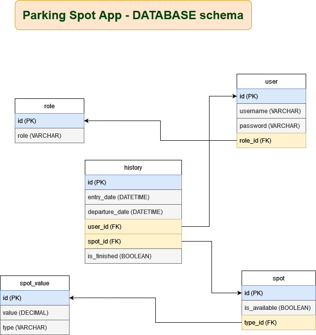

<h1>Parking Spot App</h1>

This project has as its objective to simulate a parking spot logical system. To achieve this goal, I've coded all the backend with Java using the SpringBoot framework and some of its ecosystem projects like Spring Security and Spring Data JPA.

The chosen database to store all the necessary data was PostgreSQL and was deployed on Heroku such as the back-end.

The front-end framework used was React, with ContextApi for state management and React Router Dom to deal with routes.

<h6>The following picture shows a diagram of how the database was normalized and structured.</h6>

<h2>You can try the application using this link</h2>
<a>https://parking-spot-app-frontend.herokuapp.com</a>
WARNING: the application may have a delay at first, this is because the Heroku is been loading and deploying the application container
